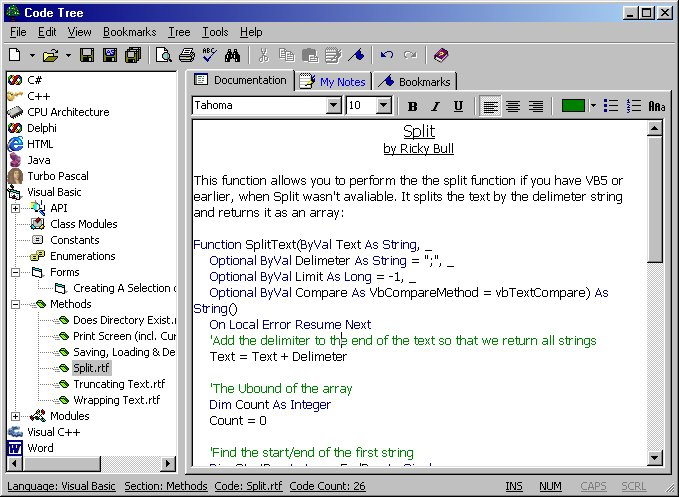



## Code Tree \(incl\. Sample Codes and Colour Picker & Progress Bar OCX\)

### Description

UPDATE: NEW VERSION CAN BE FOUND AT http://www.planet-source-code.com/vb/scripts/ShowCode.asp?txtCodeId=41941&lngWId=1

This program is for keeping a store of useful code in an easily manageable way. It creates a Tree View of all the code (or any RTF/Text document) in the app's path (incl. sub DIRs). I wrote this quite a while ago, so there are bad ways of doing things, and bugs, but on the whole it does what it's supposed to. I think there are about 25 code samples in different languages, and you may add your own including custom categories - just create sub directories with a large and small bmp in them and they will be added to the tree. Anyway, if you like it or want to leave any comments/vote please do. If you need some help then just e-mail me or leave a comment here.
 
### More Info
 

             |
---                |---
**Submitted On**   |2002-04-11 15:04:56
**By**             |[Rick Bull](https://github.com/Planet-Source-Code/PSCIndex/blob/master/ByAuthor/rick-bull.md)
**Level**          |Intermediate
**User Rating**    |5.0 (70 globes from 14 users)
**Compatibility**  |VB 5\.0, VB 6\.0
**Category**       |[Complete Applications](https://github.com/Planet-Source-Code/PSCIndex/blob/master/ByCategory/complete-applications__1-27.md)
**World**          |[Visual Basic](https://github.com/Planet-Source-Code/PSCIndex/blob/master/ByWorld/visual-basic.md)
**Archive File**   |[Code\_Tree\_716634132002\.zip](https://github.com/Planet-Source-Code/rick-bull-code-tree-incl-sample-codes-and-colour-picker-progress-bar-ocx__1-33770/archive/master.zip)

